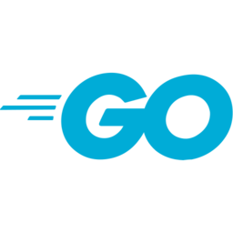

### *Salvete!* 👋

This page, like so many things, is a work in progress &hellip;

## Experience

My resume has much of my *professional* experience; I hope, here, to list personal 'likes' 

**Programming Languages**

   &nbsp; &nbsp;    &nbsp; 
<!-- 
   - this didn't work, either way ... 
   -   
  
 
   - &ndash; OR &ndash;
  -->  
      

*What I'm working on*

 &nbsp; 

**"Technologies"**

 

<!--
**GParks/GParks** is a ✨ _special_ ✨ repository because its `README.md` (this file) appears on your GitHub profile.

Here are some ideas to get you started:

- 🔭 I’m currently working on ...
- 🌱 I’m currently learning ...
- 👯 I’m looking to collaborate on ...
- 🤔 I’m looking for help with ...
- 💬 Ask me about ...
- 📫 How to reach me: ...
- 😄 Pronouns: ...
- ⚡ Fun fact: ...
-->

